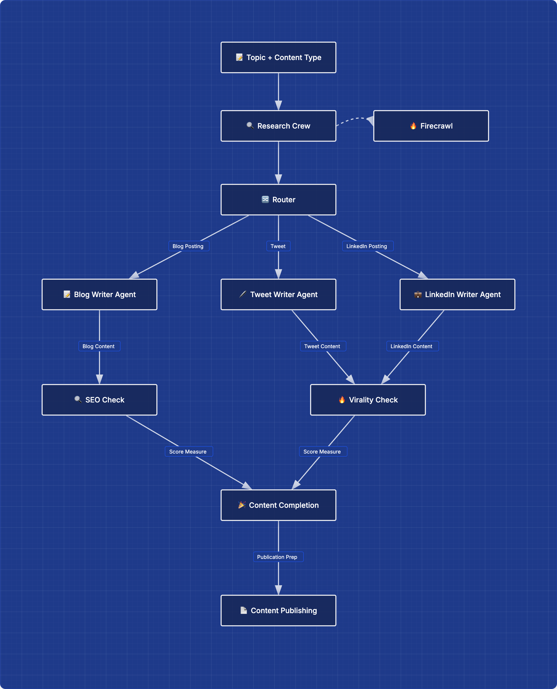

# Content Pipeline Agent

## 🎯 Goal
Automatically generate optimized content across multiple platforms based on a given topic and content format (such as blog or tweet).

---

## 🤝 Cooperative Agents

### Research Crew
Collects structured information on the topic through web searches and expert analysis to provide a foundation for content creation.

### Writer Agent
Creates a content draft based on the information gathered by the Research Crew.

### SEO & Viral Evaluation Agent
Analyzes the created draft to maximize search visibility (SEO) and viral reach.  
Delivers a final version ready for immediate publishing along with analysis reports.

---

## 📘 Workflow Diagram 

