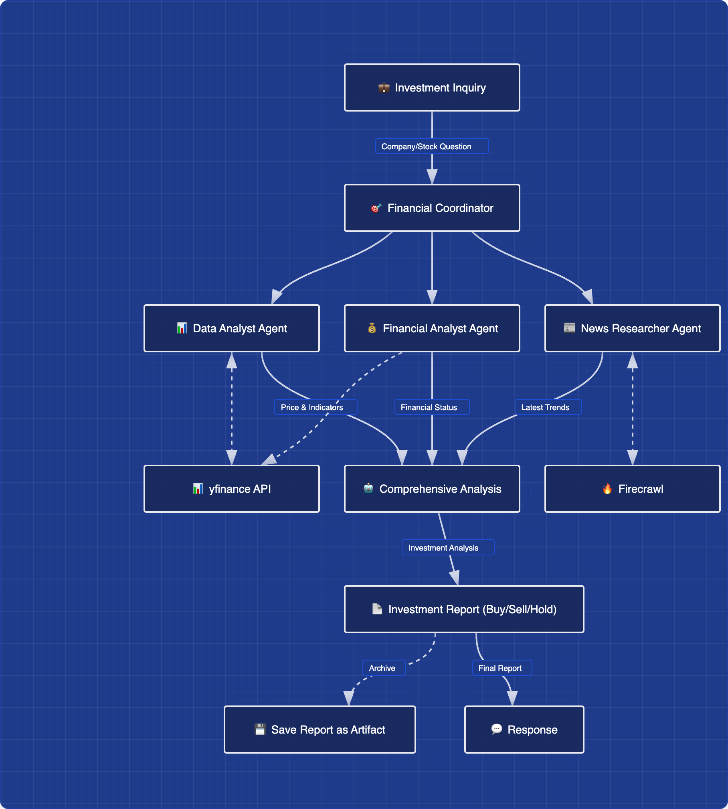

# Investment Strategy Agent

## 🎯 Goal
Build a professional investment analysis system that synthesizes real-time market data and news to deliver highly reliable investment strategies (buy/sell/hold).

---

## 🤝 Cooperative Agents

### Data Analyst Agent
Uses yfinance to collect core data such as real-time prices, company information, and financial indicators.

### News Researcher Agent
Searches and scrapes the latest news via the Firecrawl API to understand overall market sentiment and investor psychology.

### Financial Analysis Agent
Conducts deep analysis of corporate financial statements, including income statements, balance sheets, and cash-flow statements.

### Final Analysis & Recommendation Agent
Aggregates the results from the three agents and produces a final investment report based on the user’s investment profile (goals, risk tolerance), containing concrete price targets and execution strategies.  
The report is stored through ADK persistence for long-term tracking.

---

