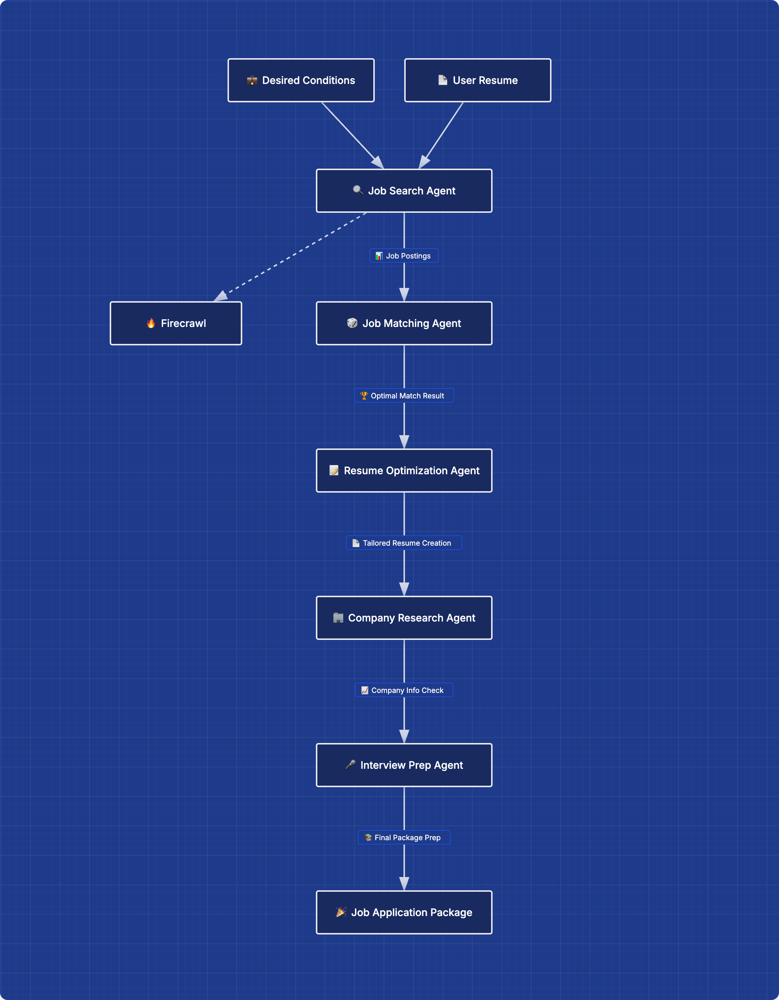

# Job Hunter Agent

## 🎯 Goal
Provide optimized job application support by leveraging the user's resume and target job preferences—covering everything from job posting discovery to interview preparation, and guiding the user through the entire job search process.

---

## 🤝 Cooperative Agents

### Job Posting Search Agent
Scrapes major job platforms to identify job postings that match the user's conditions and preferences.

### Job Matching Agent
Analyzes the scraped job postings against the user's experience and skills, then assigns a compatibility score to each posting.

### Resume Optimization Agent
Refines and optimizes the user’s resume based on the job roles determined to be the best fit.

### Company Research Agent
Conducts in-depth research on target companies to gather strategic insights useful for the application process.

### Interview Preparation Agent
Generates comprehensive interview preparation materials—such as predicted interview questions and study plans—based on the collected information.

---

## 📘 Workflow Diagram 

