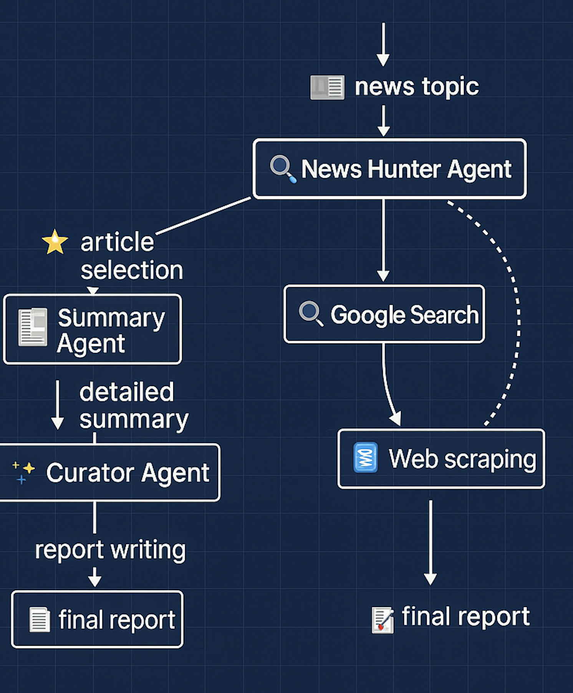

# News Reader Agent

## 🎯 Goal
Generate news reports on input news topics that are ready to publish.

---

## 🤝 Cooperative Agents

### 1. 🔍 News Hunter Agent
Collects articles on the topic using Google search and website scraping, and assigns scores to each article based on quality and relevance.

### 2. 📝 Summary Agent
Extracts the key topics and statistical data from the selected articles and produces detailed summaries.

### 3. ✨ Curator Agent
Creates the final report based on the summaries, including major articles, breaking news, editorial analysis, related readings, and accurate citation information.

---

## 📘 Workflow Diagram

